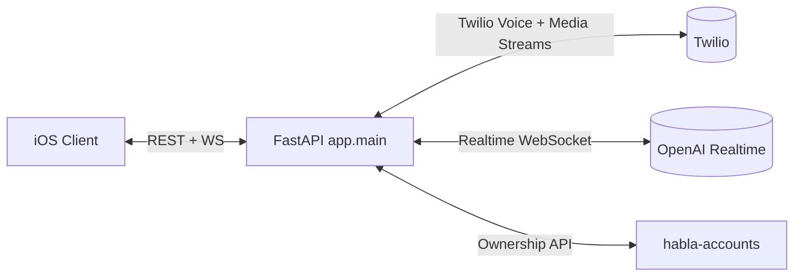
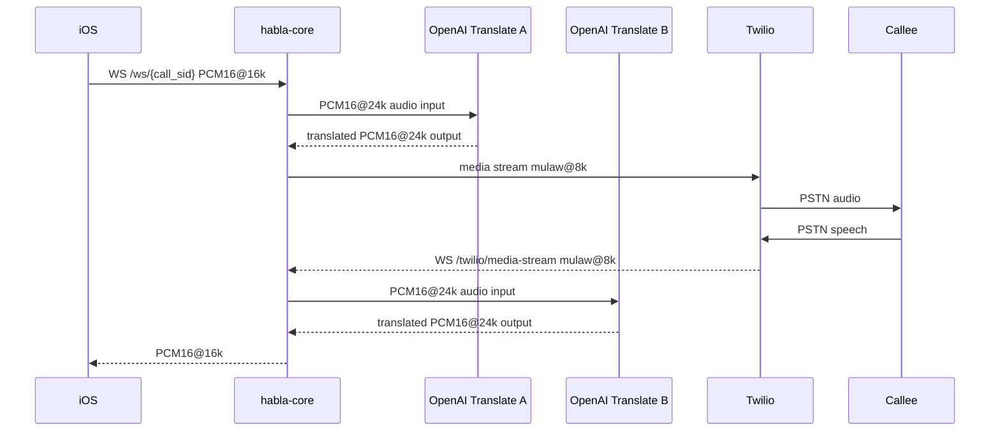
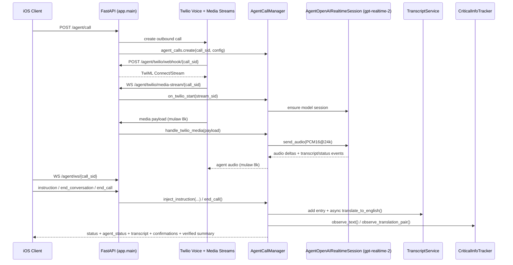

# Architecture

## 1. Scope

- Live call translation APIs and media bridges
- Agent mode orchestration APIs/websockets
- Caller-ID verification APIs with device-scoped ownership enforcement

## 2. System Context

## 3. Process Architecture

Main modules:

- `app/main.py`: route definitions and WS endpoints
- `app/call_manager.py`: in-memory translation call registry
- `app/translation_bridge.py`: dual-session audio routing pipeline
- `app/openai_realtime.py`: OpenAI realtime translation session wrapper
- `app/agent/*`: agent-mode lifecycle, transcript, critical-info tracking
- `app/caller_id/*`: Twilio caller-id + ownership integration
- `app/request_auth.py`: REST/WS authorization and device-id helpers

## 4. Live Call Translation Design

### 4.1 Dual-session model

Per active translation call, `TranslationBridge` runs two model sessions:

- Session A: iOS speech (source) -> target-language audio -> Twilio callee
- Session B: Twilio callee speech (target) -> source-language audio -> iOS

### 4.2 Audio and transport path

### 4.3 Latency/queue design

`translation_bridge.py` uses bounded queues and drop-oldest behavior under pressure:

- input queues per session
- output queues for Twilio and iOS sinks

This keeps end-to-end latency bounded during burst/backpressure scenarios.

It also logs per-direction latency checkpoints:

- ingress -> model send
- model send -> first output audio
- first output audio -> websocket send

## 5. Translation Call Lifecycle

1. `POST /call` validates languages and voice gender
2. Backend initiates Twilio outbound call (`twilio_handler.initiate_outbound_call`) with inline TwiML that opens `/twilio/media-stream`
3. `CallManager` creates `CallState` with `TranslationBridge`
4. iOS connects `WS /ws/{call_sid}` and starts session A
5. Twilio connects `WS /twilio/media-stream` and starts session B
6. Audio flows bidirectionally until hangup/disconnect
7. `cleanup_call` closes bridge tasks/sessions and websockets (idempotent lock)

`POST /twilio/webhook` remains available as a compatibility TwiML endpoint, but the primary outbound path currently sends TwiML directly in call creation.

## 6. Agent Mode Architecture

Agent mode is implemented independently from translation call bridge (`app/agent/*`).

Core components:

- `AgentCallManager`: state machine + orchestration
- `AgentOpenAIRealtimeSession`: `gpt-realtime-2` session for autonomous dialog
- `TranscriptService`: transcript + async EN translation
- `CriticalInfoTracker`: high-risk extraction, confirmations, verified summary

iOS agent WS receives structured events (`status`, `agent_status`, transcript events, critical confirmation, verified summary).

### 6.1 Agent Mode Runtime Sequence

## 7. Caller-ID and Ownership Architecture

Caller-id flow combines Twilio verified outgoing caller-ids with ownership claims in `habla-accounts`:

- verify/start or verify/status confirms Twilio side
- claim SID to `X-Habla-Device-ID`
- list returns Twilio caller-ids filtered by owned SIDs
- delete requires ownership match and removes both Twilio and claim record

This prevents one device from using another device's verified caller-id mapping.

## 8. Security Model

### 8.1 Request auth

If `HABLA_SECRET` is configured:

- iOS REST + iOS websocket routes require `Authorization`
- expected token: `HMAC_SHA256(HABLA_SECRET, HABLA_APP_BUNDLE_ID)` (raw token or `Bearer <token>`)

Twilio webhook/media endpoints are intentionally unauthenticated and validated by Twilio call context.

### 8.2 Device-scoped operations

Caller-id ownership-sensitive endpoints require:

- `X-Habla-Device-ID`

## 9. Deployment Architecture (EC2)

Current CI deploy model (`.github/workflows/deploy-ec2.yml`):

- push to `main` triggers syntax validation
- source sync to EC2 via `rsync`
- dependency installation in server venv
- `systemctl restart habla-core`
- local health probe on `127.0.0.1:8000`

Runtime state is in-memory for active calls; process restart drops active session state.

## 10. Operational Considerations

- Horizontal scale requires externalized call/session state or sticky routing
- Twilio media streams and iOS WS must land on same process owning the call state
- Bounded queue strategy prioritizes recency over completeness during overload
- Agent mode contains richer logic and higher CPU/network cost than translation call mode
